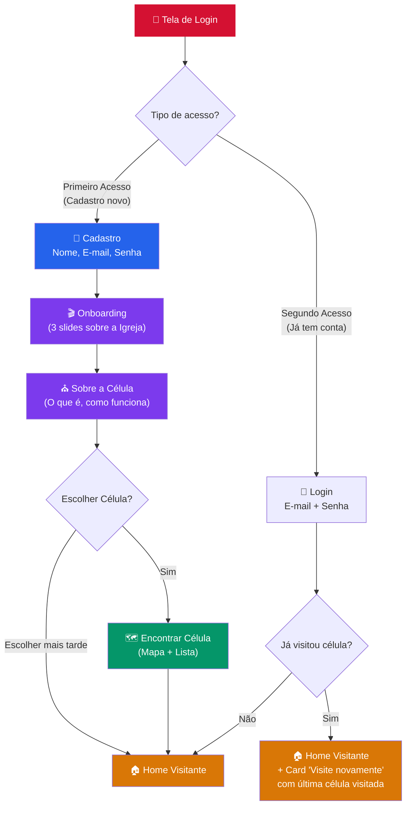

# Fluxo do Visitante — Documentação de Processo

## Visão Geral

O fluxo do visitante possui **duas hipóteses** baseadas no estado do usuário:

---

## Hipótese 1 — Primeiro Acesso

### Sequência de Telas

| Passo | Tela | Arquivo | Descrição |
|-------|------|---------|-----------|
| 1 | Login | `login.html` | Tela inicial com opção "Criar conta" |
| 2 | Cadastro | `cadastro-visitante.html` | **[NOVA]** Formulário: nome, e-mail, senha, telefone |
| 3 | Onboarding 1 | `onboarding.html` | **[NOVO]** Slide 1: "Bem-vindo à Videira" — Sobre a igreja |
| 3 | Onboarding 2 | `onboarding.html` | Slide 2: "O que é uma Célula?" — Comunidade, discipulado |
| 3 | Onboarding 3 | `onboarding.html` | Slide 3: "Sua jornada começa aqui" — Próximos passos |
| 4 | Escolher Célula | `escolher-celula.html` | **[NOVO]** Tela com mapa/lista + botão "Escolher mais tarde" |
| 5 | Home Visitante | `home-visitante.html` | Tela inicial do visitante |

### Detalhes de Cada Tela

#### Cadastro (cadastro-visitante.html) — NOVA TELA
- Nome completo
- E-mail
- Senha + confirmar senha
- Telefone (opcional)
- Botão "Criar minha conta"
- Link "Já tenho conta" → volta pro login

#### Onboarding (onboarding.html) — NOVA TELA
Tela com 3 slides (swipe horizontal), progresso com indicadores:
- **Slide 1:** Logo + "Bem-vindo à Videira" + imagem da igreja + texto breve
- **Slide 2:** "O que é uma Célula?" + ícones (Comunidade, Discipulado, Multiplicação)
- **Slide 3:** "Sua jornada começa aqui" + botão "Continuar"

#### Escolher Célula (escolher-celula.html) — NOVA TELA
- Lista de células próximas (com distância se possível)
- Ou mapa interativo
- Botão primário: "Escolher esta célula"
- Botão secundário: **"Escolher mais tarde"** → vai direto para Home Visitante

---

## Hipótese 2 — Segundo Acesso (Retorno)

### Sequência de Telas

| Passo | Tela | Arquivo | Descrição |
|-------|------|---------|-----------|
| 1 | Login | `login.html` | Entra com e-mail + senha |
| 2 | Home Visitante | `home-visitante.html` | **MODIFICADA** — exibe card de última célula visitada |

### Modificações na Home Visitante
A `home-visitante.html` será modificada para mostrar condicionalmente:

**Se já visitou uma célula:**
- Card "Visite novamente" com:
  - Nome da célula
  - Nome do líder
  - Dia e horário
  - Endereço
  - Botão "Quero visitar de novo"
  - Botão "Ver outras células"

**Se nunca visitou:**
- Mantém o layout atual com botão "Localizar Célula"

---

## Telas Existentes que Serão Reaproveitadas

| Arquivo Atual | Decisão |
|---------------|---------|
| `boas-vindas/bem-vindo.html` | ⭢ Substituída por `onboarding.html` (mais completa) |
| `boas-vindas/mensagem.html` | ⭢ Conteúdo integrado no onboarding slide 2 |
| `boas-vindas/mensagem-lider.html` | ⭢ Conteúdo integrado na Home quando tem célula visitada |
| `boas-vindas/kit-digital.html` | ⭢ Conteúdo integrado no onboarding slide 3 |
| `encontrar-celula.html` | ⭢ Mantida como referência, `escolher-celula.html` será variante simplificada |
| `home-visitante.html` | ⭢ Modificada para suportar os dois cenários |

---

## Resumo das Ações

| Ação | Arquivo | Tipo |
|------|---------|------|
| Criar | `pages/cadastro-visitante.html` | 🆕 Nova tela |
| Criar | `pages/onboarding.html` | 🆕 Nova tela |
| Criar | `pages/escolher-celula.html` | 🆕 Nova tela |
| Modificar | `pages/login.html` | ✏️ Ajustar fluxo do visitante |
| Modificar | `pages/home-visitante.html` | ✏️ Adicionar card "Visite novamente" |
